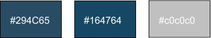
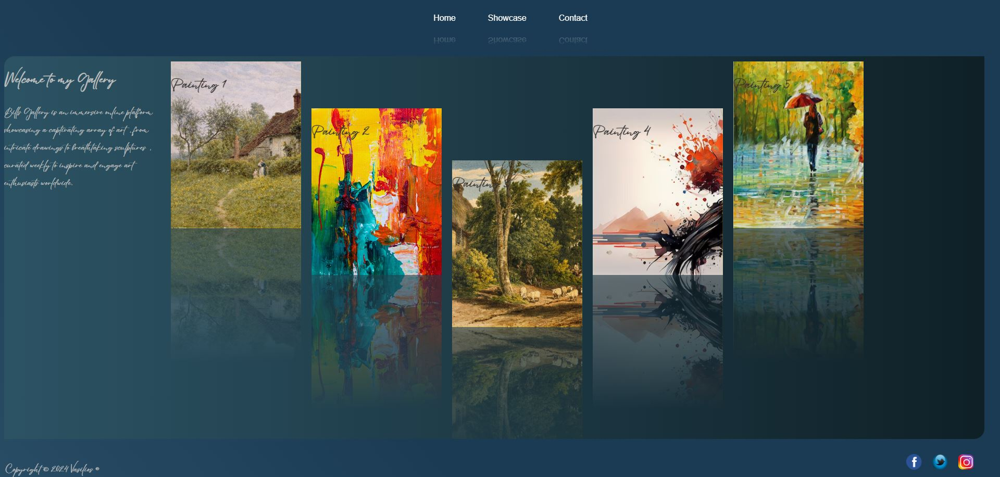
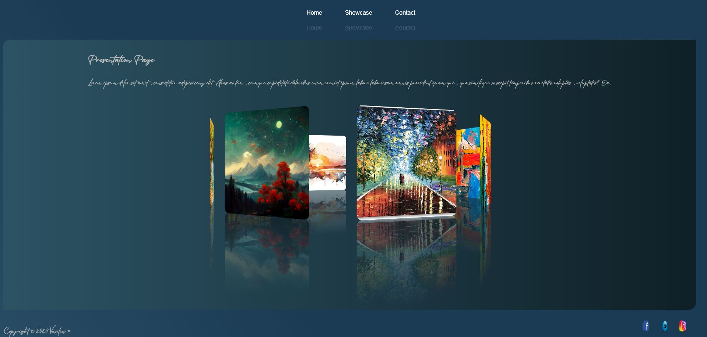
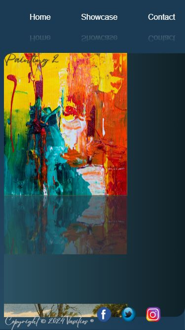
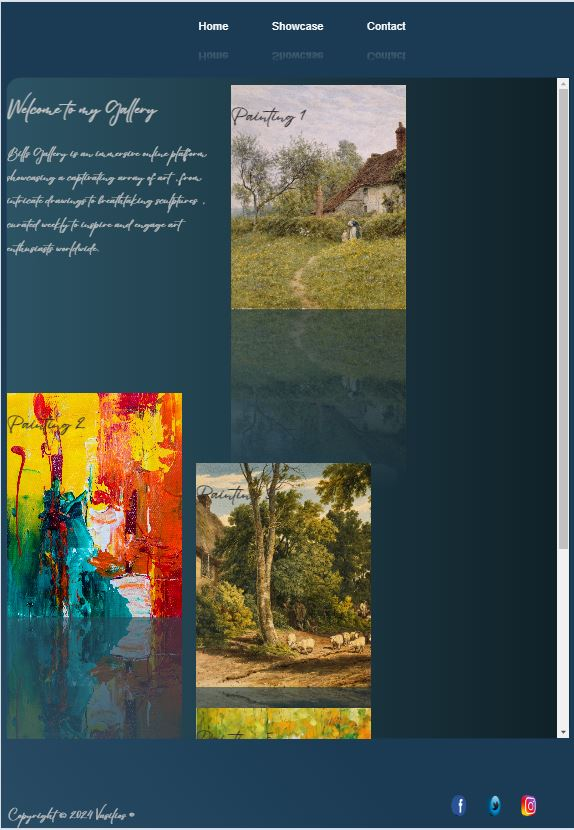

# Contents

- [About Me](#about-me)
- [User Experience](#user-experience)
- [Design](#design)
    - [Colour Scheme](#colour-scheme)
    - [Typography](#typography)
- [Features](#features)
    - [General Features on Each page](#general-features-on-each-page)
    - [Future Implementations](#future-implementations)
    - [Pages](#pages)
        - [Home page](#home-page)
        - [Guide page](#guide-page)
        - [Setup page](#setup-page)
        - [Contact page](#contact-page)
    - [Accessibility](#accessibility)
      - [Smooth scroll-behavior](#smooth-scroll-behavior)
      - [Quick access bar](#quick-access-bar)
    - [Multiscreen Support](#multiscreen-support)
        - [Mobile](#mobile)
        - [Tablet](#tablet)
- [Technologies Used](#technologies-used)
- [Deployment & Local Development](#deployment--local-development)
  - [Deployment](#deployment)
  - [Local Development](local-development)
- [Testing](#testing)
  - [W3C Validator](#w3c-validator)
- [Credits](#credits)
    - [Youtube Channels](#youtube-channels)
    - [Content](#content)
    - [Images](#images)
    - [Acknowledgments](#acknowledgments)

# About Me

Student at Code Institute.

- [@Vasilis](https://github.com/ozz1webdev)

# User Experience

Bills Gallery is a website where art is showcased. Art are collected and showcased, from Drawings, Sculptures and other kind of Art.

# Design

## Colour Scheme

## Typography

Used Font for H1 is Eyesome-Script

# Features

## General Features on Each page

* The menu bar is fixed and it has 3 items.On mouse Hover the items change the background color and the width.

* On touch screens will be only the click action without the animation.

* The Home page have 5 cards with the top 5 Pictures.

* The Showcase page has a presentation of all the Pictures.

* The Contact page have a picture with water effect on mouse over and the Contact form.

* The footer contains 3 linked icons for facebook twitter(X) and instagram

## Future Implementations

Login for the Artist and the users

## Pages

### Home page

This is the Landing page, it contains the welcome text and the 5 pictures.

### Showcase

This page contain a Carousel Showcase all of the pictures

### Contact

in this page is the contact form

## Accessibility

The complete web site is created in single page no need for scrolling.Scrolling exist only on back of the picture's description if the text is longer from the container 

## Multiscreen Support

### Mobile

### Tablet

# Technologies Used

* [jquery](https://jquery.com/) - Used for the ripples effect

* [VScode](https://code.visualstudio.com/) - for coding.

* [Github](https://github.com/) - To save and store files for this site.

* [W3Schools](https://www.w3schools.com/html/default.asp) - For Code properties where i forgot 

* [W3X Validator](https://validator.w3.org/) - For testing html/css code

# Testing

## W3C Validator

# Credits

## Content

## Images

* [Unsplash](https://unsplash.com/) - Images downloaded from.

* [Jason Leung](https://unsplash.com/photos/black-wireless-headphones-on-black-surface-xR4JHzr69Og?utm_content=creditCopyText&utm_medium=referral&utm_source=unsplash) - Image used on the home page.

## Acknowledgments

* Graeme Taylor - My Code Institute Mentor.
