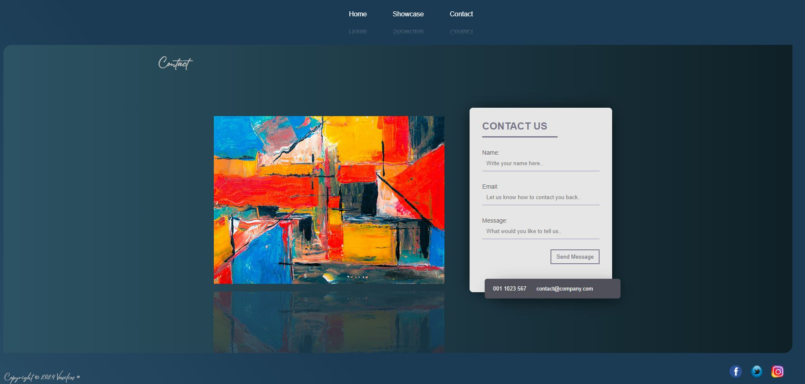

# Contents

- [About Me](#about-me)
- [User Experience](#user-experience)
- [Design](#design)
    - [Colour Scheme](#colour-scheme)
    - [Typography](#typography)
- [Features](#features)
    - [General Features on Each page](#general-features-on-each-page)
    - [Future Implementations](#future-implementations)
    - [Pages](#pages)
        - [Home page](#home-page)
        - [Showcase page](#showcase)
        - [Contact page](#contact-page)
    - [Accessibility](#accessibility)
    - [Multiscreen Support](#multiscreen-support)
        - [Mobile](#mobile)
        - [Tablet](#tablet)
- [Technologies Used](#technologies-used)
- [Testing](#testing)
  - [W3C Validator](#w3c-validator)
- [Credits](#credits)
    - [Youtube Channels](#youtube-channels)
    - [Images](#images)
    - [Acknowledgments](#acknowledgments)

# About Me

Student at Code Institute.

- [@Vasilis](https://github.com/ozz1webdev)

# User Experience

Bill's Gallery is a website where art is showcased. Art are collected and showcased, from Drawings, Sculptures and other kind of Art.
Artist all over the world can rent as well the website to showcase their work.
All images at the website are examples from random google search and are free to use credits to the owner's.

Live Preview : [Bill's Gallery](https://ozz1webdev.github.io/codeproject1/)

# Design

## Colour Scheme

## Typography

Used Font for H1 and p tags is Eyesome-Script

# Features

## General Features on Each page

* The menu bar is fixed and it has 3 items.On mouse Hover the items change the background color and the width.

* On touch screens will be only the click action without the animation.

* The Home page have 5 cards with the top 5 Pictures.

* The Showcase page has a presentation of all the Pictures.

* The Contact page have a picture with water effect on mouse over and the Contact form.

* The footer contains 3 linked icons for facebook twitter(X) and instagram

## Future Implementations

Login for the Artist and the users

## Pages

### Home page

This is the Landing page, it contains the welcome text and the 5 pictures.

### Showcase

This page contain a Carousel Showcase all of the pictures

### Contact

in this page is the contact form

## Accessibility

The complete web site is created in single page no need for scrolling.Scrolling exist only on back of the picture's description if the text is longer from the container 

## Multiscreen Support

### Mobile

### Tablet

# Technologies Used

* [jquery](https://jquery.com/) - Used for the ripples effect

* [VScode](https://code.visualstudio.com/) - for coding.

* [Github](https://github.com/) - To save and store files for this site.

* [W3Schools](https://www.w3schools.com/html/default.asp) - For Code properties where i forgot 

* [W3X Validator](https://validator.w3.org/) - For testing html/css code

# Testing

## W3C Validator
Gratulation! Es wurden keine Fehler gefunden.
# Credits
## Images

* [youtube chanels](https://www.youtube.com/@codingcirculate) - For the carousel and Cards Code

* [youtube chanels](https://www.youtube.com/@codingcirculate) - For the carousel 

* [Google](https://www.google.com/) - Images downloaded from.

## Acknowledgments

* Jubril Akolade - My Code Institute Mentor.
